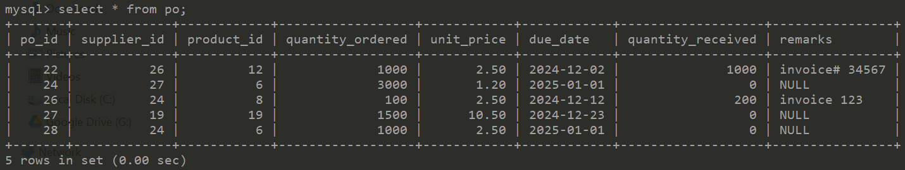

# Project Assessment
Module 7: Back End Development \
Submitted by: Tan Chee Meng (Sam Tan) \
Date: 30-Oct-2024 \
GitHub link: https://github.com/SamTan20240527/BackEndDevelopmentAssessment/

# Introduction
A souvenirs shop needs a purchase order system to keep track of product purchases. As this is just a simple prototype, there is no inventory nor sales order. Also, each PO consists of a single line only. 

# ER Diagram

# Database
A local MySQL database is deployed
- 4 tables: po, supplier, product & category
- 2 views: po_view & product_view, to present data in a more user-friendly way

(Note: All mysql-related files and images are in the [mysql/] folder)

